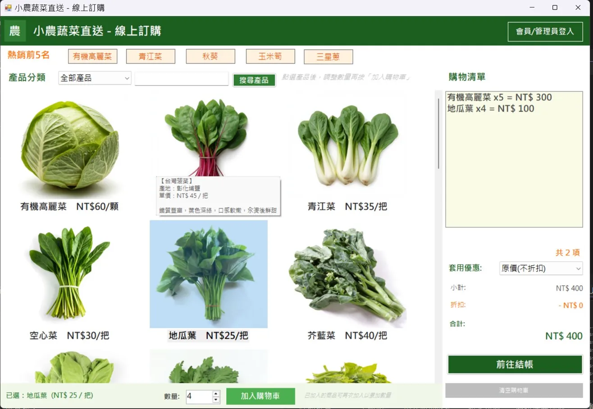
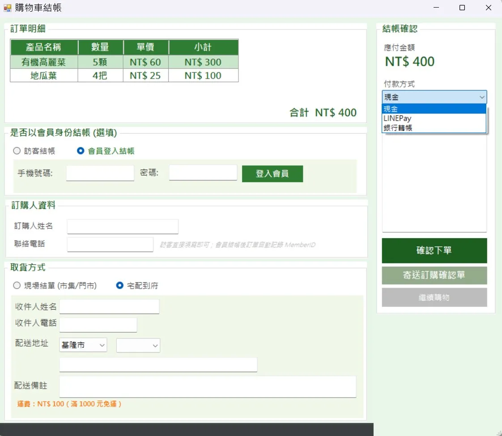
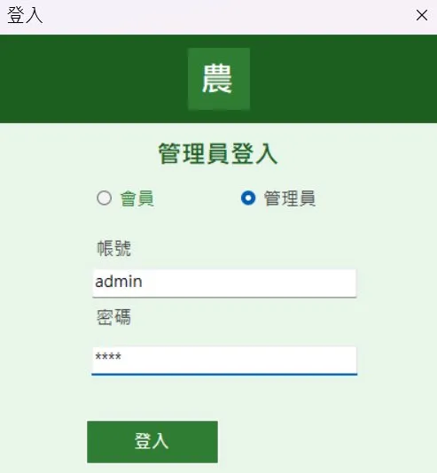
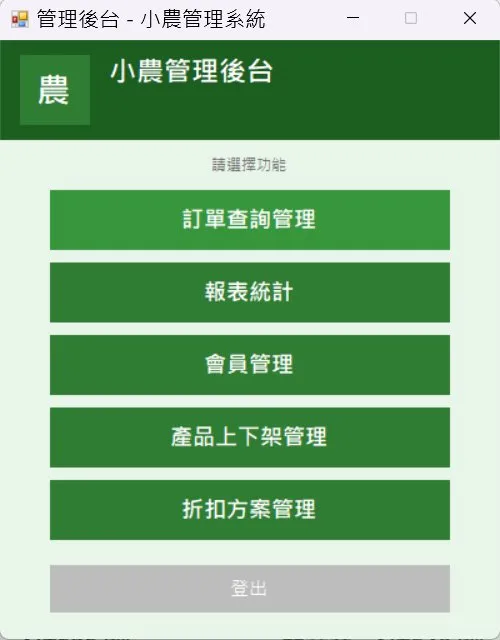
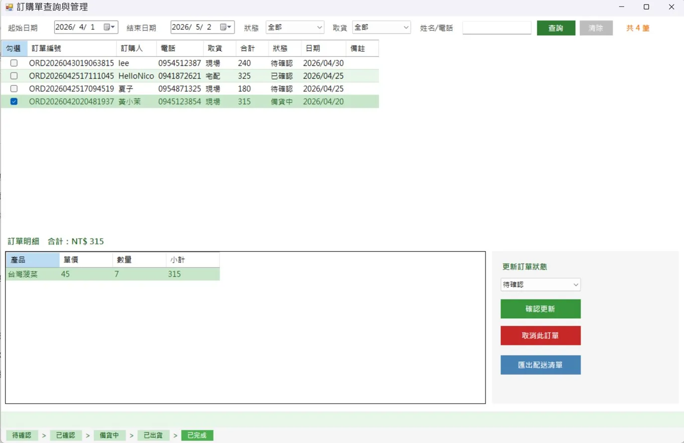

# FarmOrder — 團購收單整合系統

輕量級團購收單系統，支援會員訂購、訪客結帳、後台訂單管理與彈性折扣設定。

## 系統畫面

### 線上訂購

### 購物車結帳

### 登入頁面

### 管理後台

### 訂單管理

## 技術棧
- C# / Windows Forms / .NET Framework
- SQL Server / ADO.NET
- Visual Studio 2022

## 功能特色
- 會員 / 訪客雙模式結帳
- 快照設計保護歷史訂單金額
- 權限分級（管理員 / 老闆 / 店員 / 會員）
- 宅配 / 現場取貨切換
- 彈性折扣方案（門檻折扣 / 買一送一）
